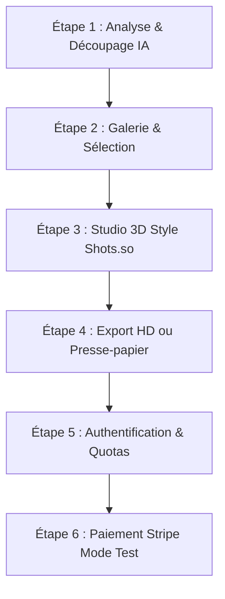

# 🧪 Plan d'Action & Protocole de Test — OmniMockup Studio

Ce guide pratique pas-à-pas vous permet de **tester l'intégralité du site** comme un utilisateur réel ou un client payant, depuis votre navigateur sur `http://localhost:3000`.

---

## 📋 Résumé du Parcours de Test

---

## PHASE 1 : Test du Tunnel de Capture & IA Vision

> **Objectif** : Vérifier que le scraping automatique et l'IA Gemini découpent parfaitement n'importe quel site web.

### Actions à réaliser :
1. Ouvrez votre navigateur sur **`http://localhost:3000`**.
2. Dans le champ de saisie d'URL, testez l'un de ces 3 sites :
   * Site SaaS moderne : `https://linear.app`
   * Boutique e-commerce : `https://al-kareem-parfurmerie.vercel.app` (ou `https://gymshark.com`)
   * Plateforme tech : `https://stripe.com`
3. Cliquez sur le bouton **« Analyser le site avec l'IA »**.
4. **Ce que vous devez observer** :
   * La barre de progression affiche les étapes : *Crawl ➔ Capture HD Playwright ➔ Analyse Gemini Vision*.
   * Après 5 à 15 secondes, les sections sont découpées : **Hero**, **Features/Avantages**, **Tarifs**, **Témoignages**, **Pied de page**.
   * Chaque section a un badge de qualité, un verdict et un score marketing sur 100.
   * La jauge de quota mensuel s'actualise.

---

## PHASE 2 : Test du Studio 3D (Standard Shots.so)

> **Objectif** : Valider toutes les fonctionnalités de retouche, de perspective 3D, de fonds et d'export.

### Actions à réaliser :
1. Dans la galerie de résultats, cliquez sur une section (ex: *Hero* ou *Capture Complète*).
2. Choisissez un premier cadre dans le sélecteur (ex: **MacBook Pro** ou **Navigateur Web**) et cliquez sur **« Valider et ouvrir dans le Studio (shots.so) »**.

### Checklist des réglages à tester dans le Studio :

#### A. Onglet "Mockup" (Contrôles de l'appareil)
* [ ] **Changer de modèle** : Cliquez sur les 5 appareils (**Web**, **MacBook**, **iPad**, **iPhone**, **Flat**). Vérifiez que le cadre s'adapte instantanément.
* [ ] **Mode Sombre / Clair (sur le modèle Web)** : Basculez entre *Clair* (Sun) et *Sombre* (Moon). La barre d'adresse et les bordures passent en noir sidéral ou blanc pur.
* [ ] **Finition Glassmorphism** : Cliquez sur *Glass*. Le cadre prend un effet de transparence dépolie.
* [ ] **Rayon des angles** : Testez *Sharp (0px)*, *Curved (16px)* et *Round (28px)*.
* [ ] **Perspective 3D (Le test clé !)** :
  * Déplacez le curseur **Tilt Vertical (Pitch)** vers +15° ou -15° (le mockup plonge ou bascule vers l'arrière).
  * Déplacez le curseur **Tilt Horizontal (Yaw)** vers +15° (le mockup pivote de biais en 3D).
  * Déplacez le curseur **Rotation Angulaire (Angle Z)**.
  * Cliquez sur **« Remettre à plat (0°) »** ou sur le bouton **« Recentrer »** en haut pour vérifier le reset instantané.
* [ ] **Échelle & Zoom** : Ajustez le curseur d'échelle de 50% à 120%.
* [ ] **Ombres Studio** : Désactivez puis réactivez l'ombre portée, et modifiez son curseur d'intensité.

#### B. Onglet "Cadre" (Fond & Format d'export)
* [ ] **Ratios réseaux sociaux** : Cliquez sur **Twitter / X (16:9)**, **Instagram (1:1)**, **Dribbble (4:3)**, **Story / Reel (9:16)**. Le cadre change de proportions sans déformer l'image.
* [ ] **Fonds Magiques Apple Mesh** : Testez *macOS Sonoma*, *Tahoe Sunset*, *Big Sur Pacific*, *Aurora Glow*, *Dark Obsidian*.
* [ ] **Option Fond Transparent (Détouré)** : Activez le switch *Détouré*. Le fond affiche un damier gris/blanc et sera totalement transparent à l'export.
* [ ] **Option Grain Studio** : Activez le switch *Grain Studio*. Une fine texture de papier photo s'ajoute sur le fond.

#### C. Onglets "Texte" et "Logo"
* [ ] Cliquez sur **« Ajouter un calque de texte »**, saisissez un titre, changez sa couleur, et déplacez-le à la souris ou au doigt sur le canvas.
* [ ] Importez un logo PNG/SVG et réglez sa largeur.

#### D. Moteur d'Exportation Pro
* [ ] **Test Copier dans le presse-papier** :
  * Cliquez sur le bouton **« Copier »** dans la barre supérieure.
  * Attendez 1 seconde que le bouton affiche **« Copié ! »**.
  * Ouvrez une conversation Slack, Discord, Twitter, WhatsApp ou Paint, et faites **`Ctrl + V`** (ou `Cmd + V`). L'image doit se coller directement !
* [ ] **Test Téléchargement Haute Définition** :
  * Sélectionnez **2x** ou **4x** dans le sélecteur de résolution.
  * Cliquez sur **« Télécharger »**.
  * Ouvrez le fichier PNG téléchargé sur votre ordinateur : l'image doit être d'une netteté parfaite (Retina ou 4K).

---

## PHASE 3 : Test de l'Authentification Supabase

> **Objectif** : Vérifier que les comptes utilisateurs, les profils et les sessions fonctionnent sans accroc.

### Actions à réaliser :
1. Cliquez sur **« S'inscrire »** dans la barre de navigation (ou allez sur `http://localhost:3000/signup`).
2. Créez un compte test avec un email et un mot de passe (ex: `testuser@example.com` / `MotDePasse123!`).
3. Vérifiez la redirection vers `/account` ou l'accueil avec votre email affiché dans la Navbar.
4. Cliquez sur **« Mon Compte »** (`/account`) :
   * Votre email doit s'afficher.
   * Votre plan actif doit être **Gratuit (Free)**.
   * La jauge doit indiquer **0 / 3 analyses utilisées ce mois-ci**.
5. Testez la déconnexion, puis reconnectez-vous via `/login`.
6. *(Optionnel si configuré sur Supabase)* : Testez le bouton **« Continuer avec Google »**.

---

## PHASE 4 : Test des Quotas d'Utilisation

> **Objectif** : Vérifier que le blocage et la conversion vers l'offre payante se déclenchent correctement.

### Actions à réaliser :
1. En étant connecté sur un compte Gratuit (limité à 3 analyses/mois) :
   * Effectuez 3 analyses de sites différents.
   * À la 4ème tentative, vérifiez qu'une modale s'affiche :  
     **« Quota mensuel atteint — Passez au plan Pro pour des analyses illimitées »**.
2. Cliquez sur le bouton de la modale **« Débloquer le Plan Pro »** : il doit vous rediriger directement vers la page des tarifs (`/pricing`).

---

## PHASE 5 : Test du Paiement Stripe (Mode Test Sécurisé)

> **Objectif** : Vérifier le parcours complet d'achat jusqu'à l'activation du statut Pro.

### Actions à réaliser :
1. Rendez-vous sur la page **`http://localhost:3000/pricing`**.
2. Sur la carte **Plan Pro (19 €/mois)**, cliquez sur **« Passer au Plan Pro »**.
3. Vous êtes redirigé vers la page sécurisée **Stripe Checkout**.
4. Utilisez les identifiants de test officiels Stripe :
   * **Numéro de carte** : `4242 4242 4242 4242`
   * **Date d'expiration** : N'importe quelle date future (ex: `12/28`)
   * **CVC** : `123`
   * **Nom** : *Jean Testeur*
5. Cliquez sur **« Payer »**.
6. Vous êtes redirigé vers votre page `/account` avec le message de succès.
7. Votre statut passe à **Pro (Analyses illimitées)** et le bouton **« Gérer mon abonnement »** ouvre le portail Stripe Customer Portal pour tester la résiliation ou le changement de carte.

---

## 📊 Grille de Synthèse de Vos Tests

Remplissez ce tableau au fur et à mesure de vos essais :

| N° | Scénario testé | Statut | Remarques / Observations |
| :--- | :--- | :---: | :--- |
| **1** | Analyse d'un site web par URL | ⬜ OK / ⬜ Échec | |
| **2** | Découpage des sections par l'IA | ⬜ OK / ⬜ Échec | |
| **3** | Rendu des 5 modèles d'appareils | ⬜ OK / ⬜ Échec | |
| **4** | Inclinaison 3D (Tilt X / Tilt Y) | ⬜ OK / ⬜ Échec | |
| **5** | Bouton Copier dans le presse-papier | ⬜ OK / ⬜ Échec | |
| **6** | Export PNG en résolution 2x ou 4x | ⬜ OK / ⬜ Échec | |
| **7** | Inscription & Connexion Supabase | ⬜ OK / ⬜ Échec | |
| **8** | Blocage par la modale de Quota (3/3) | ⬜ OK / ⬜ Échec | |
| **9** | Paiement Stripe Test (Carte 4242) | ⬜ OK / ⬜ Échec | |
| **10** | Passage au statut Pro illimité | ⬜ OK / ⬜ Échec | |
