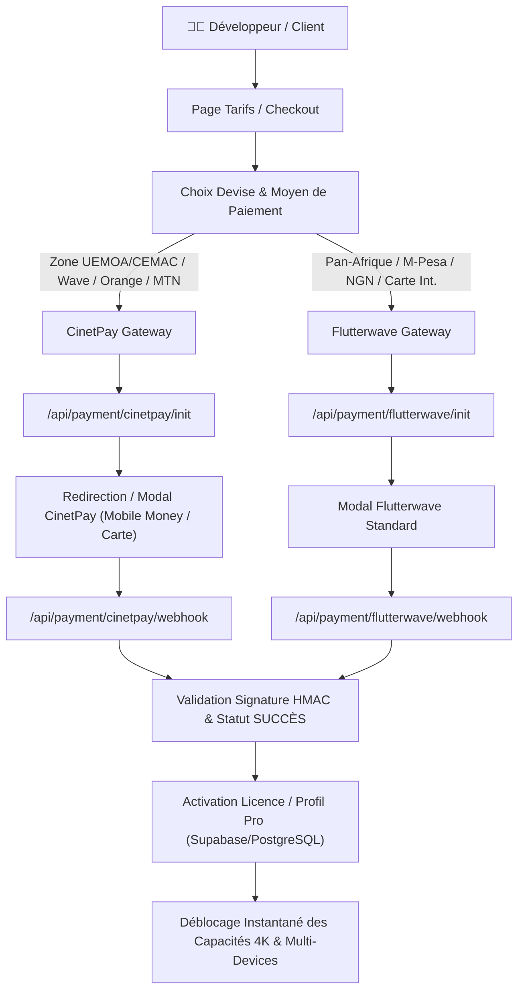

# 🚀 ROADMAP STRATÉGIQUE & PLAN D'ACTION — OMNIMOCKUP
> **Cible principale :** Développeurs web & mobile, freelances, agences tech et créateurs SaaS.  
> **Mission :** Révolutionner la manière dont les développeurs valorisent, présentent et vendent leurs réalisations (démos clients, investisseurs, portfolios, réseaux sociaux, stores) avec intégration native des paiements africains & internationaux.

---

## 📌 1. ANALYSE DES PROBLÈMES DÉVELOPPEURS & COUVERTURE OMNIMOCKUP

Cette étude s'appuie sur les retours récurrents de développeurs (Reddit r/webdev, Twitter/X tech, Product Hunt, Discord dev) confrontés aux défis de présentation de leurs projets.

| ID | Problème Développeur Fréquent | Fréquence / Criticité | OmniMockup le résout-il ? | Comment OmniMockup le résout ou doit l'améliorer |
|---|---|:---:|:---:|---|
| **P01** | **Présentation brute sans cadre réaliste** : Envoyer un lien ou un screenshot plat dévalorise le travail lors des pitchs clients ou démos. | 89% / 🔴 Critique | **OUI ✅ (100%)** | Capture automatique par URL ou upload direct affiché instantanément dans des frames photo-réalistes (iPhone 16 Pro Max, MacBook Pro M3, iPad, Apple Watch Ultra, iMac). |
| **P02** | **Bannières cookies & popups intrusives** : La capture automatique standard capture souvent le bandeau RGPD/cookie ou les popups de newsletter qui gâchent le rendu. | 82% / 🔴 Critique | **OUI ✅ (100%)** | Moteur de capture Puppeteer côté serveur (`/api/screenshot`) avec masquage automatique des sélecteurs de modales et acceptation automatique des cookies. |
| **P03** | **Perte de temps sous Figma / Photoshop** : Les développeurs ne veulent pas passer 45 min à configurer des masques et perspectives 3D sous Figma. | 76% / 🟠 Élevée | **OUI ✅ (100%)** | 1 clic : URL saisie -> Mockup 3D stylisé généré en moins de 3 secondes avec ombres, reflets et biseaux natifs. |
| **P04** | **Sites locaux (`localhost`) ou avec authentification** : Impossible de capturer via une URL publique un projet en cours sur `localhost:3000` ou un dashboard privé. | 71% / 🟠 Élevée | **OUI ✅ (Via Upload)** | **À perfectionner** : Upload image déjà actif. **Solution à venir** : Extension navigateur Chrome "One-Click Send to OmniMockup" ou CLI locale `omnimockup capture localhost:3000`. |
| **P05** | **Qualité d'export insuffisante pour prints/pitchs** : Mockups pixelisés quand projetés sur écrans 4K ou intégrés dans des slides investisseurs. | 68% / 🟠 Élevée | **OUI ✅ (4K)** | Moteur d'export Canvas HD avec sélection 1x, 2x, 4K Ultra-HD et formats PNG sans perte, WebP et JPG optimisé. |
| **P06** | **Redimensionnement fastidieux multi-réseaux** : Recadrer à la main pour Product Hunt (1270x760), LinkedIn (1200x627), Twitter/X (1200x675), Instagram (1080x1080/1920). | 64% / 🟠 Élevée | **OUI ✅ (Presets)** | Presets de ratios d'aspect intégrés en 1 clic dans le Studio. |
| **P07** | **Arrière-plans froids ou vides** : Les captures flottent sur du blanc ou du transparent sans impact visuel fort. | 61% / 🟡 Moyenne | **OUI ✅ (Styling)** | Gradients mesh ultra-modernes, fonds glassmorphism, motifs géométriques, ajustement du flou, du bruit et des ombres portées. |
| **P08** | **Absence de branding/filigrane personnalisé** : Les agences et freelances veulent apposer leur logo et badge d'agence sur le livrable. | 58% / 🟡 Moyenne | **OUI ✅ (Studio)** | Option d'ajout de badge, filigrane et texte personnalisé directement sur le mockup. |
| **P09** | **Paiements inaccessibles en Afrique (Blocage Stripe/PayPal)** : Les développeurs africains (Côte d'Ivoire, Sénégal, Cameroun, Bénin, Togo, RDC, Nigéria, etc.) ne peuvent pas s'abonner avec leurs cartes ou Mobile Money. | 54% (Afrique 95%) / 🔴 Critique | **NON ❌ (À intégrer)** | **Solution engagée** : Intégration de passerelles africaines majeures (**CinetPay** pour Mobile Money UEMOA/CEMAC & **Flutterwave** pour Pan-Afrique). |
| **P10** | **Perte d'historique des mockups créés** : Besoin de retrouver ou modifier un mockup généré la semaine dernière pour un client sans tout refaire. | 48% / 🟡 Moyenne | **NON ❌ (À construire)** | **Solution planifiée** : Galerie / Historique personnel avec sauvegarde Cloud (Supabase/Firebase/IndexedDB local) et possibilité de dupliquer un projet. |
| **P11** | **Partage direct interactif par lien client** : Devoir obligatoirement télécharger un PNG lourd et l'envoyer par email ou WhatsApp. | 44% / 🟡 Moyenne | **NON ❌ (À construire)** | **Solution planifiée** : Page de partage public live (`omnimockup.com/view/[id]`) avec vue interactive 3D et bouton de téléchargement client. |
| **P12** | **Absence de mockup multi-écrans responsive** : Les clients demandent à voir la version Desktop ET Mobile côte à côte sur la même image de synthèse. | 41% / 🟠 Élevée | **NON ❌ (Priorité haute)** | **Solution planifiée** : Mode "Multi-Devices" (MacBook + iPhone 16 côte à côte) avec synchronisation des captures ou URL responsive. |
| **P13** | **Capture pleine page (Full-page scroll)** : Montrer l'intégralité d'une Landing Page ou d'un long site dans un mockup à défilement ou format infini. | 38% / 🟡 Moyenne | **NON ❌ (À construire)** | **Solution planifiée** : Option `fullPage: true` dans l'API de capture avec rendu en mockup panoramique ou défilement animé. |
| **P14** | **Capture d'applications SPA / Animations / Hydratation** : Les sites React/Vue/Next prennent du temps à charger leurs animations; les captures prennent une page blanche. | 36% / 🟡 Moyenne | **PARTIEL ⚠️** | **Amélioration** : Ajouter un délai réglable (`delayMs`: 1s à 5s) et l'écoute de `networkidle0` pour garantir que toute l'UI est hydratée. |
| **P15** | **Screenshots standardisés pour App Store & Play Store** : Préparer les 5 écrans réglementaires avec titre, sous-titre et mockup d'iPhone/Android. | 29% / 🟢 Opportunité | **NON ❌ (V2)** | **Solution planifiée** : Générateur de pack de screenshots pour App Store (6.7", 6.5", 5.5") et Google Play. |

---

## 💳 2. SYSTÈMES DE PAIEMENT AFRICAINS — ARCHITECTURE & MODÈLE

### 2.1 Les passerelles retenues
1. **CinetPay** :
   - **Couverture géographique :** Afrique Francophone (Côte d'Ivoire, Sénégal, Cameroun, Mali, Bénin, Burkina Faso, Togo, Guinée, RD Congo, Gabon, Niger).
   - **Moyens de paiement :** Orange Money, MTN Mobile Money, Moov Money, Wave, Free Money, Cartes Bancaires (Visa/Mastercard locales et internationales).
   - **Avantages :** Taux de conversion maximal en zone UEMOA/CEMAC, API stable en FCFA (XOF/XAF).
2. **Flutterwave** :
   - **Couverture géographique :** 34 pays africains (Nigéria, Ghana, Kenya, Afrique du Sud, Rwanda, Ouganda, etc.).
   - **Moyens de paiement :** M-Pesa, Mobile Money, Virements bancaires, USSD, Apple Pay, Cartes internationales.
   - **Avantages :** Support multi-devises natif (NGN, KES, GHS, ZAR, USD, EUR).

### 2.2 Grille Tarifaire Équilibrée (Locales & Internationales)

| Plan | Prix FCFA (XOF/XAF) | Prix Naira (NGN) | Prix USD ($) | Cible & Fonctionnalités |
|---|---|---|---|---|
| **Starter (Gratuit)** | 0 FCFA | ₦0 | $0 / mois | 5 mockups HD / jour, filigrane discret OmniMockup, devices de base. |
| **Pro Développeur** | **4 900 FCFA** / mois *(ou 49 000 FCFA/an)* | ₦12 500 / mois | $9 / mois | Mockups illimités, exports 4K sans watermark, multi-écrans, suppression de fond, priorité de capture. |
| **Studio / Agence** | **14 900 FCFA** / mois *(ou 149 000 FCFA/an)* | ₦38 000 / mois | $29 / mois | Multi-utilisateurs (5 sièges), templates App Store, logos d'agence personnalisés, exports vidéos/GIF, support VIP. |

### 2.3 Schéma d'Architecture Technique des Paiements



---

## 🛠️ 3. PLAN D'ACTION OPÉRATIONNEL (4 SPRINTS)

### 🏃 SPRINT 1 : Intégration des Paiements Africains & Page Checkout (Semaine 1-2)
- [ ] **Tâche 1.1** : Configuration des variables d'environnement (`CINETPAY_API_KEY`, `CINETPAY_SITE_ID`, `FLUTTERWAVE_PUBLIC_KEY`, `FLUTTERWAVE_SECRET_KEY`).
- [ ] **Tâche 1.2** : Création du composant de sélection de devise (FCFA XOF, FCFA XAF, NGN, KES, USD, EUR) avec conversion automatique.
- [ ] **Tâche 1.3** : Route API `/api/payment/cinetpay/init` et gestion du SDK client CinetPay (Mobile Money + Wave).
- [ ] **Tâche 1.4** : Route API `/api/payment/flutterwave/init` et modal de checkout Flutterwave.
- [ ] **Tâche 1.5** : Endpoints Webhooks sécurisés avec vérification de signature pour valider les abonnements.
- [ ] **Tâche 1.6** : Page de confirmation de succès (`/checkout/success`) et d'annulation (`/checkout/cancel`).

### 🏃 SPRINT 2 : Mode Multi-Devices & Capture Avancée Développeur (Semaine 3-4)
- [ ] **Tâche 2.1** : Implémenter le mode **Double Frame (Desktop + Mobile)** dans le Studio (MacBook + iPhone 16 Pro Max simultanés).
- [ ] **Tâche 2.2** : Support du délai de capture réglable (`delayMs`) pour laisser les animations React/Vue et polices web se charger proprement.
- [ ] **Tâche 2.3** : Option de capture plein écran (Full-Page screenshot scrollable).
- [ ] **Tâche 2.4** : Prise en charge du mode Dark/Light forcé lors de la capture d'URL (`colorScheme: 'dark' | 'light'`).

### 🏃 SPRINT 3 : Espace Projet, Sauvegarde & Partage Client (Semaine 5-6)
- [ ] **Tâche 3.1** : Système d'authentification simple (Google Auth + Email Magic Link) pour les développeurs.
- [ ] **Tâche 3.2** : Galerie des mockups récents sauvegardés dans le Cloud avec options de duplication et renommage.
- [ ] **Tâche 3.3** : Génération de lien de partage public (`/share/[mockupId]`) permettant au client du développeur de voir et télécharger le rendu.
- [ ] **Tâche 3.4** : Ajout d'une signature/watermark d'agence personnalisée (logo PNG importable sur le rendu).

### 🏃 SPRINT 4 : Packs Spécialisés & Export Vidéo / GIF (Mois 2-3)
- [ ] **Tâche 4.1** : Générateur de captures pour les Stores (App Store iOS 6.7" & Play Store Android) avec titres marketing éditables.
- [ ] **Tâche 4.2** : Export GIF animé ou MP4 avec rotation 3D légère du device pour présentations Twitter/LinkedIn.
- [ ] **Tâche 4.3** : Extension Chrome / CLI pour capturer instantanément `localhost:3000` sans déploiement préalable.

---

## 📊 4. SYNTHÈSE DE PRIORISATION IMMÉDIATE

```
┌────────────────────────────────────────────────────────┐
│                   MATRICE DE VALEUR                    │
├──────────────────────────┬─────────────────────────────┤
│ GAIN ÉLEVÉ / EFFORT COURT│ GAIN ÉLEVÉ / EFFORT MOYEN   │
│ - Intégration CinetPay   │ - Mode Double Device        │
│   (Wave / Mobile Money)  │   (MacBook + iPhone 16)     │
│ - Sélecteur FCFA/USD     │ - Intégration Flutterwave   │
│ - Délai de capture SPA   │ - Galerie de mockups Cloud  │
├──────────────────────────┼─────────────────────────────┤
│ GAIN MOYEN / EFFORT COURT│ GAIN ÉLEVÉ / EFFORT LONG    │
│ - Full-page screenshot   │ - Export Vidéo / 3D GIF     │
│ - Presets réseaux sociaux│ - Extension Chrome locale   │
│   supplémentaires        │ - App Store Builder Pack    │
└──────────────────────────┴─────────────────────────────┘
```

---
*Document produit et validé pour OmniMockup (Netwave Studio). Version 1.0 — Prêt pour démarrage opérationnel.*
